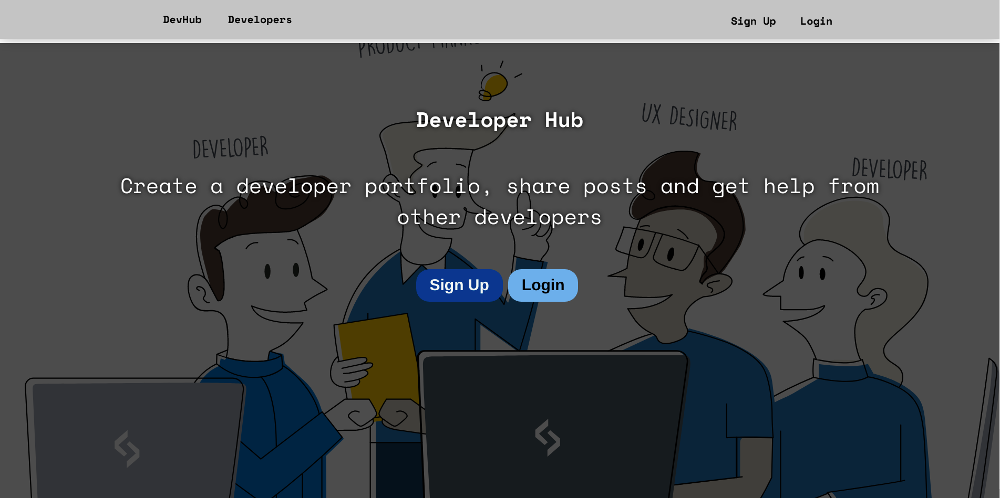
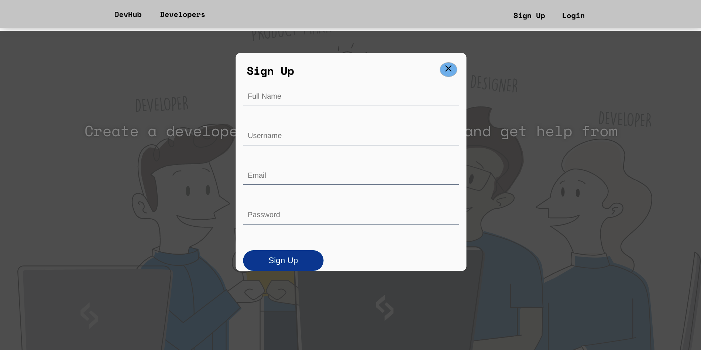
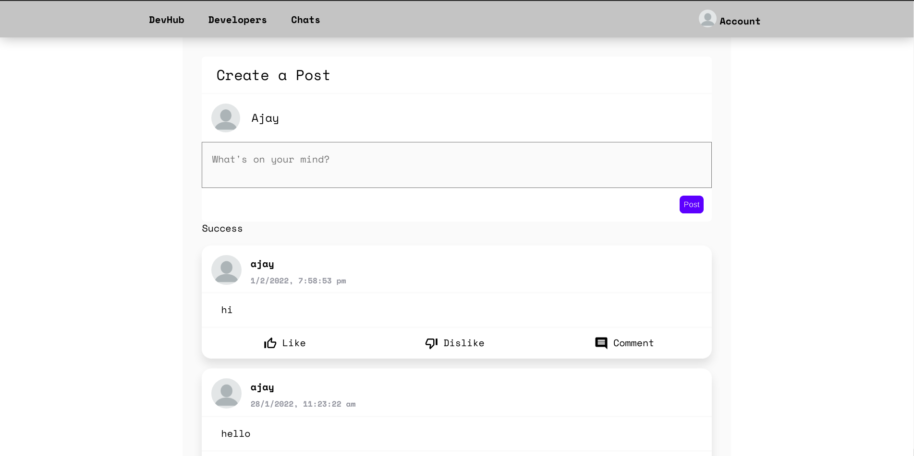

# MERN Devloper Hub - Social Network for Developers

A MERN stack social network application for developers with MVP features implemented: user authentication, profile viewing, posting, portfolio creating and chatting.

## Deploy

Frontend Deployed on netlify
Backend Deployed on heroku

## Demo

[MERN Developer Hub](https://devhub-dev.netlify.app/)

## Contributing
Pull requests are welcome. For major changes, please open an issue first to discuss what you would like to change.

## License

Distributed under the MIT License. See `LICENSE.md` for more information.

## Screenshots

See more images in /screenshots directory

